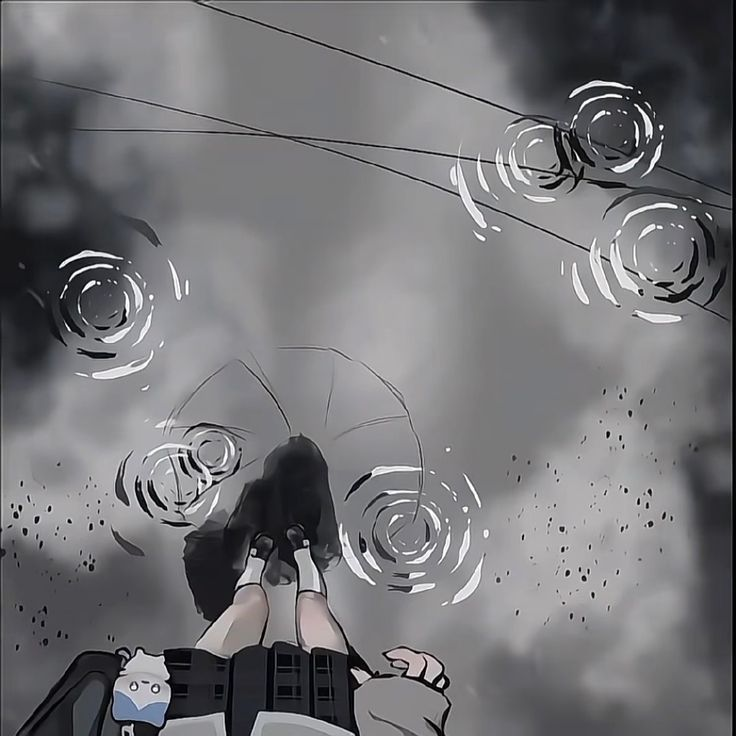

# Unite 1 - Recursion
*Simdi birlikte 5 tane kolaydan zora recursion problemi verecegim. Once kendin cozmeye calis daha sonra benim cozumlerime bak.*

---

## Sorular

| # | Challenge | Zorluk |
|---|-----------|--------|
| 1 | Faktoriyel Hesaplama | Kolay |
| 2 | Fibonacci Sayisi | Kolay |
| 3 | Palindrom Kontrolu | Orta |
| 4 | Dizideki Maksimum Eleman | Orta-Zor |
| 5 | Labirent Cozucu | Zor |

---

### Soru 1 - Faktoriyel Hesaplama

Pozitif bir tam sayinin faktoriyelini recursive bir sekilde hesaplayan bir method yaz.

Ornek: 5! = 5 * 4 * 3 * 2 * 1 = 120

### Soru 2 - Fibonacci Sayisi Hesaplama

Fibonacci Dizisisinin n'inci elemanini hesaplayan bir method yaz.

Fibonacci dizisi: 1, 1, 2, 3, 5, 8 ...

### Soru 3 - Palindrom Kontrolu

Bir stringin palindrom olup olmadigini kontrol eden bir method yaz.

Palindrom tersten de duzden de ayni okunan yazilara denir. Ornek kayak, radar...

### Soru 4 - Dizideki Maksimum Elemani Bulma

Verilen dizideki en buyuk tam sayiyi recursive olarak bulan bir method yaz.

### Soru 5 - Labirent Cozucu

2 Boyutlu bir labirentte baslangic noktasindan cikis noktasina giden bir yol olup olmadigini kontrol eden bir method yaz.

Labirent kurallari:

- 0 yurunebilen yol

- 1 duvar

LABIRENT SOL USTTEN BASLAYIP SAG ALTTA BITIYOLABIRENT SOL USTTEN BASLAYIP SAG ALTTA BITIYORR

---
